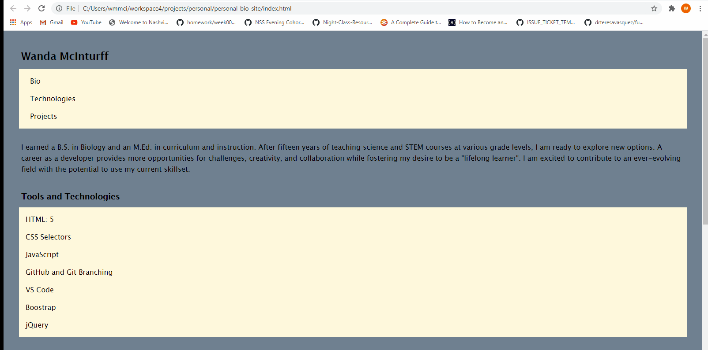

### Personal Bio Site
This site was built as an individual assignment at Nashville Software School. The purpose of the site is to showcase accomplishments, projects, and skills acquired. The site would be beneficial to prospective employers.

### Demo

### Technologies Used
* HTML
* CSS
* JavaScript

### Deployed

### Credits/Contributors
 * [Wanda McInturff](https://github.com/wmmcinturff)